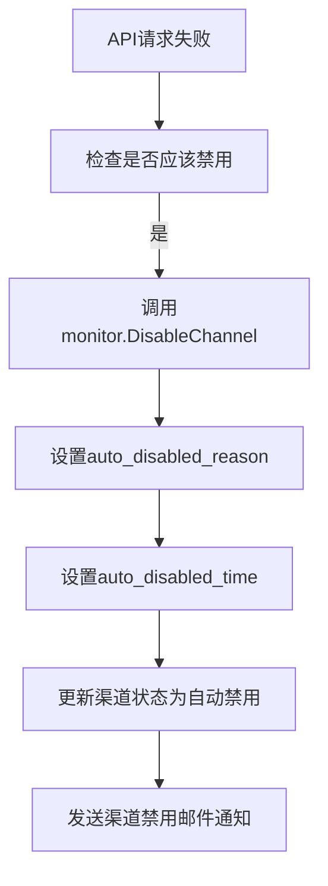
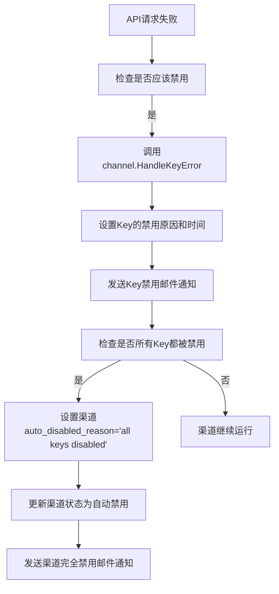

# 更新的自动禁用逻辑说明

## 🎯 实现的功能逻辑

根据您的需求，已实现以下精确的自动禁用逻辑：

### 1. 单Key渠道自动禁用

**行为**：
- 遇到错误时，直接禁用整个渠道
- 禁用原因：具体的API错误信息（如 "Incorrect API key provided"）

**存储位置**：
- `channels.auto_disabled_reason` = 具体错误信息
- `channels.auto_disabled_time` = 禁用时间戳
- `channels.status` = 3 (ChannelStatusAutoDisabled)

**邮件通知**：
- 发送渠道级别的禁用通知
- 包含具体的错误原因和时间

### 2. 多Key渠道自动禁用

#### 2.1 单个Key禁用
**行为**：
- 单个Key遇到错误时，只禁用该Key
- 渠道继续运行（如果还有其他可用Key）

**存储位置**：
- `channels.multi_key_info.key_metadata[index].disabled_reason` = 具体错误信息
- `channels.multi_key_info.key_metadata[index].disabled_time` = 禁用时间戳
- `channels.multi_key_info.key_metadata[index].status_code` = HTTP状态码
- `channels.multi_key_info.key_status_list[index]` = 3 (ChannelStatusAutoDisabled)

**邮件通知**：
- 发送Key级别的禁用通知
- 包含Key索引、脱敏Key、错误原因、状态码

#### 2.2 所有Key都被禁用
**行为**：
- 当最后一个可用Key被禁用时，自动禁用整个渠道

**存储位置**：
- `channels.auto_disabled_reason` = "all keys disabled" （固定文本）
- `channels.auto_disabled_time` = 禁用时间戳
- `channels.status` = 3 (ChannelStatusAutoDisabled)
- 各Key的具体禁用原因仍保留在 `key_metadata` 中

**邮件通知**：
- 发送渠道级别的完全禁用通知
- 说明所有Key都已禁用

## 📋 前端展示逻辑

### 1. 渠道列表页面

**单Key渠道**：
```
状态列：[自动禁用]
禁用原因列：显示具体错误信息
```

**多Key渠道**：
```
状态列：[自动禁用] 或 [启用]
禁用原因列：
- 如果渠道被禁用：显示 "all keys disabled"
- 如果渠道正常：显示 "-" 或 "部分Key禁用"
```

### 2. 多Key管理页面

在多Key渠道的详情页面中：
```
Key列表表格：
| Key索引 | 状态      | 禁用原因                        | 禁用时间        | 状态码 |
|---------|-----------|--------------------------------|----------------|--------|
| Key #0  | 启用      | -                              | -              | -      |
| Key #1  | 自动禁用  | Incorrect API key provided     | 2024-01-15 14:30 | 401   |
| Key #2  | 自动禁用  | You exceeded your current quota | 2024-01-15 15:20 | 429   |
```

## 🔄 完整的处理流程

### 单Key渠道错误处理流程


### 多Key渠道错误处理流程


## 💾 数据库结构

### channels表新增字段
```sql
ALTER TABLE channels ADD COLUMN auto_disabled_reason TEXT NULL;
ALTER TABLE channels ADD COLUMN auto_disabled_time BIGINT NULL;
```

### multi_key_info JSON结构
```json
{
  "is_multi_key": true,
  "key_count": 3,
  "key_status_list": {
    "0": 1,  // 启用
    "1": 3,  // 自动禁用
    "2": 3   // 自动禁用
  },
  "key_metadata": {
    "1": {
      "disabled_reason": "Incorrect API key provided",
      "disabled_time": 1705307400,
      "status_code": 401
    },
    "2": {
      "disabled_reason": "You exceeded your current quota",
      "disabled_time": 1705310800,
      "status_code": 429
    }
  }
}
```

## 📧 邮件通知类型

### 1. 单Key渠道禁用通知
```
主题：渠道「OpenAI-GPT4」（#123）已被禁用
内容：包含具体错误原因和禁用时间
```

### 2. 多Key渠道Key禁用通知
```
主题：多Key渠道「OpenAI-Multi」（#456）中的Key已被禁用
内容：包含Key索引、脱敏Key、错误原因、状态码
```

### 3. 多Key渠道完全禁用通知
```
主题：多Key渠道「OpenAI-Multi」（#456）已被完全禁用
内容：说明所有Key都已禁用，原因显示为"all keys disabled"
```

## 🚀 部署说明

1. **数据库迁移**：执行 `migration_auto_disable_reason.sql`
2. **代码部署**：部署更新后的代码
3. **验证测试**：
   - 测试单Key渠道自动禁用
   - 测试多Key渠道单Key禁用
   - 测试多Key渠道全Key禁用

## ✅ 验证清单

- [ ] 单Key渠道错误时正确记录禁用原因
- [ ] 多Key渠道单Key错误时只禁用该Key
- [ ] 多Key渠道所有Key禁用时渠道标记为"all keys disabled"
- [ ] 各类邮件通知正常发送
- [ ] 前端能正确显示禁用原因
- [ ] 多Key管理页面显示Key级别的禁用信息

这个实现完全符合您的需求：
- ✅ 单Key直接禁用，显示具体原因
- ✅ 多Key在Key管理页面显示每个Key的禁用原因
- ✅ 多Key全禁用时显示"all keys disabled"
