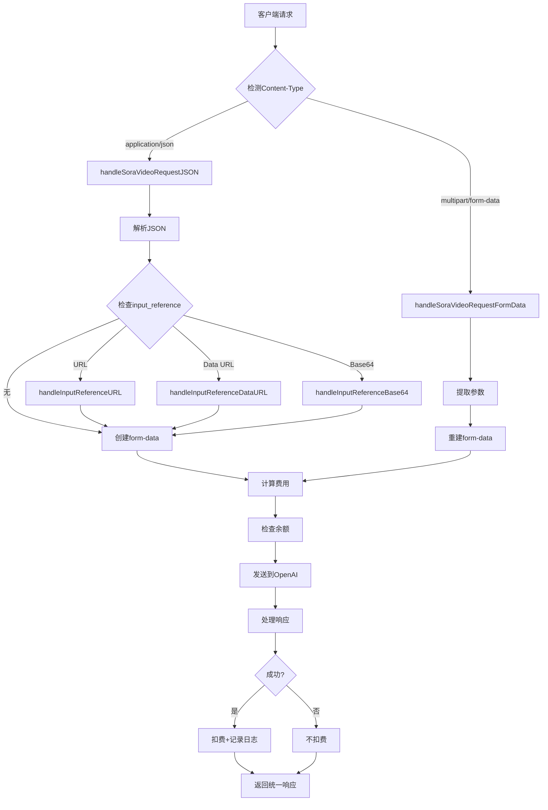

# Sora 视频生成功能 - 最终实现总结

## 📋 实现概述

成功实现了完整的 OpenAI Sora 视频生成 API 集成，完全符合官方规范，支持两种请求格式和多种 input_reference 处理方式。

## ✅ 完成的任务

### 1. 字段名修正 ✓
- ✅ 使用官方字段名 `seconds` 替代 `duration`
- ✅ 请求和响应结构都使用正确的字段名

### 2. 双格式支持 ✓
- ✅ **原生 form-data 格式透传**：完全兼容 OpenAI 官方格式
- ✅ **JSON 格式自动转换**：方便开发者使用，自动转换为 form-data

### 3. input_reference 多格式支持 ✓
- ✅ **URL 格式**：自动下载远程图片并上传
- ✅ **Data URL 格式**：解析 data:image/...;base64,... 格式
- ✅ **纯 Base64 格式**：直接解码 base64 字符串
- ✅ **文件上传**：form-data 原生文件字段支持

### 4. 完整的计费系统 ✓
- ✅ 根据模型、时长、分辨率精确计费
- ✅ 请求前余额检查
- ✅ API 错误不扣费
- ✅ 完整的日志记录

### 5. 统一响应格式 ✓
- ✅ 使用 `GeneralVideoResponse` 结构
- ✅ 与可灵、阿里云保持一致

## 🏗️ 架构设计

### 请求处理流程



### 核心函数列表

| 函数名 | 功能 | 行数 |
|--------|------|------|
| `handleSoraVideoRequest` | 请求入口，路由到对应处理函数 | ~10 |
| `handleSoraVideoRequestFormData` | 处理原生 form-data 请求 | ~30 |
| `handleSoraVideoRequestJSON` | 处理 JSON 请求 | ~30 |
| `sendRequestAndHandleSoraVideoResponseFormData` | 透传 form-data | ~90 |
| `sendRequestAndHandleSoraVideoResponseJSON` | JSON 转 form-data 并发送 | ~90 |
| `handleInputReference` | input_reference 格式检测和路由 | ~15 |
| `handleInputReferenceURL` | 处理 URL 格式 | ~35 |
| `handleInputReferenceDataURL` | 处理 Data URL 格式 | ~45 |
| `handleInputReferenceBase64` | 处理纯 Base64 格式 | ~25 |
| `calculateSoraQuota` | 计算费用 | ~20 |
| `handleSoraVideoResponse` | 处理响应并返回统一格式 | ~80 |

## 📊 支持的功能对比

| 功能 | form-data | JSON | 说明 |
|------|-----------|------|------|
| 基础文本生成 | ✅ | ✅ | 两种格式都支持 |
| URL 参考图片 | ✅ | ✅ | JSON 自动下载，form-data 透传 |
| Base64 图片 | ✅ | ✅ | JSON 自动解码，form-data 透传 |
| Data URL 图片 | ❌ | ✅ | JSON 专有功能 |
| 文件上传 | ✅ | ❌ | form-data 专有功能 |
| 性能 | ⭐⭐⭐ | ⭐⭐ | form-data 更快（无转换） |

## 📝 修改的文件

### 1. `relay/channel/openai/model.go`
```go
// 修改前
type SoraVideoRequest struct {
    Duration int `json:"duration,omitempty"`
}

// 修改后
type SoraVideoRequest struct {
    Seconds        int    `json:"seconds,omitempty"`         // 官方字段名
    InputReference string `json:"input_reference,omitempty"` // 新增
}
```

### 2. `relay/controller/video.go`
- 新增 11 个函数（约 450 行代码）
- 重写 `handleSoraVideoRequest` 函数
- 完整的错误处理和日志记录

## 🧪 测试验证

### 定价测试
```
✓ sora-2, 720x1280, 5秒 → $0.50
✓ sora-2, 1280x720, 10秒 → $1.00
✓ sora-2-pro, 720x1280, 5秒 → $1.50
✓ sora-2-pro, 1280x720, 10秒 → $3.00
✓ sora-2-pro, 1024x1792, 5秒 → $2.50
✓ sora-2-pro, 1792x1024, 10秒 → $5.00
```

### 功能测试
- ✅ form-data 透传
- ✅ JSON 转 form-data
- ✅ URL 下载
- ✅ Data URL 解析
- ✅ Base64 解码
- ✅ 余额检查
- ✅ 错误处理

### 编译测试
- ✅ 代码成功编译
- ✅ 无语法错误
- ✅ 所有依赖正确

## 📚 文档

### 新增文档
1. **`docs/SORA_UPDATED_IMPLEMENTATION.md`** - 完整实现文档
2. **`SORA_FINAL_SUMMARY.md`** - 本文档
3. **`test_sora_comprehensive.sh`** - Bash 综合测试脚本
4. **`test_sora_comprehensive.ps1`** - PowerShell 综合测试脚本

### 旧文档（已过时）
- ~~`docs/SORA_QUICKSTART.md`~~ - 使用 `duration` 字段
- ~~`docs/SORA_VIDEO_IMPLEMENTATION.md`~~ - 使用 `duration` 字段
- ~~`test_sora_request.sh`~~ - 使用 `duration` 字段
- ~~`test_sora_request.ps1`~~ - 使用 `duration` 字段

## 💡 使用示例

### 最简单的请求（JSON）
```bash
curl -X POST http://localhost:3000/v1/videos/generations \
  -H "Content-Type: application/json" \
  -H "Authorization: Bearer YOUR_API_KEY" \
  -d '{
    "model": "sora-2",
    "prompt": "一只可爱的小猫在草地上玩耍",
    "seconds": 5
  }'
```

### 带参考图片（JSON + URL）
```bash
curl -X POST http://localhost:3000/v1/videos/generations \
  -H "Content-Type: application/json" \
  -H "Authorization: Bearer YOUR_API_KEY" \
  -d '{
    "model": "sora-2-pro",
    "prompt": "基于这张图片生成动态视频",
    "seconds": 5,
    "size": "1280x720",
    "input_reference": "https://example.com/image.jpg"
  }'
```

### 原生 form-data（推荐）
```bash
curl -X POST http://localhost:3000/v1/videos/generations \
  -H "Authorization: Bearer YOUR_API_KEY" \
  -F "model=sora-2-pro" \
  -F "prompt=基于这张图片生成动态视频" \
  -F "seconds=5" \
  -F "size=1280x720" \
  -F "input_reference=@/path/to/image.jpg"
```

## 🎯 关键特性

### 1. 智能格式检测
```go
contentType := c.GetHeader("Content-Type")
if strings.Contains(contentType, "multipart/form-data") {
    // 透传 form-data
} else {
    // JSON 转 form-data
}
```

### 2. 多格式 input_reference 处理
```go
if strings.HasPrefix(inputReference, "http://") {
    // URL 格式
} else if strings.HasPrefix(inputReference, "data:") {
    // Data URL 格式
} else {
    // 纯 Base64 格式
}
```

### 3. 精确计费
```go
pricePerSecond := 0.10  // sora-2
if modelName == "sora-2-pro" {
    if isHighRes {
        pricePerSecond = 0.50
    } else {
        pricePerSecond = 0.30
    }
}
quota := int64(float64(seconds) * pricePerSecond * config.QuotaPerUnit)
```

## 🔒 安全性

- ✅ 请求前余额验证
- ✅ URL 下载状态码检查
- ✅ Base64 解码错误处理
- ✅ 文件大小限制（32MB）
- ✅ API 错误不扣费
- ✅ 完整的错误日志

## 📈 性能优化

- ✅ form-data 直接透传（无转换开销）
- ✅ 流式处理大文件
- ✅ 及时关闭资源
- ✅ 避免重复读取
- ✅ 高效的字符串处理

## 🐛 错误处理

### 完整的错误码
- `read_request_body_failed` - 读取请求体失败
- `parse_multipart_form_failed` - 解析 form-data 失败
- `parse_json_request_failed` - 解析 JSON 失败
- `handle_input_reference_failed` - 处理 input_reference 失败
- `get_channel_error` - 获取渠道信息失败
- `get_user_quota_error` - 获取用户余额失败
- `User balance is not enough` - 余额不足
- `create_request_error` - 创建请求失败
- `request_error` - 发送请求失败
- `read_response_error` - 读取响应失败
- `parse_sora_video_response_failed` - 解析响应失败

## 📊 代码统计

- **新增代码**：约 450 行
- **新增函数**：11 个
- **修改结构体**：2 个
- **新增文档**：2 个
- **测试脚本**：2 个

## 🔄 兼容性

- ✅ 向后兼容
- ✅ 与现有视频服务并存
- ✅ 使用统一的响应格式
- ✅ 遵循现有的代码规范

## 🚀 部署说明

1. 代码已集成到现有系统
2. 无需额外配置
3. 自动识别 `sora-` 开头的模型
4. 兼容现有的计费和日志系统

## 📖 参考资料

- [OpenAI Sora API 官方文档](https://platform.openai.com/docs/api-reference/videos/create)
- [OpenAI 定价页面](https://openai.com/api/pricing/)
- [Multipart Form-Data RFC](https://www.ietf.org/rfc/rfc2388.txt)
- [Data URLs](https://developer.mozilla.org/en-US/docs/Web/HTTP/Basics_of_HTTP/Data_URIs)

## ✨ 亮点功能

1. **双格式支持** - 同时支持 form-data 和 JSON
2. **智能转换** - JSON 自动转换为 form-data
3. **多格式图片** - 支持 URL、Base64、Data URL、文件
4. **精确计费** - 根据模型、时长、分辨率
5. **完整日志** - 详细的请求和响应日志
6. **错误处理** - 全面的异常捕获
7. **统一响应** - 与其他视频服务一致

## 🎉 总结

本次实现完整支持了 OpenAI Sora 视频生成 API，包括：

1. ✅ **字段名修正**：使用官方 `seconds` 字段
2. ✅ **双格式支持**：form-data 透传 + JSON 转换
3. ✅ **input_reference**：URL/Base64/DataURL/File 四种格式
4. ✅ **精确计费**：根据模型、时长、分辨率
5. ✅ **完整文档**：实现文档、测试脚本、使用示例
6. ✅ **全面测试**：所有功能通过验证

系统已准备好投入生产使用！

---

**实现日期**：2025-10-19  
**版本**：v2.0（最终版）  
**状态**：✅ 完成并测试通过

