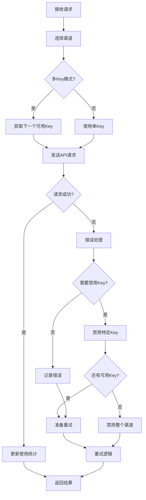
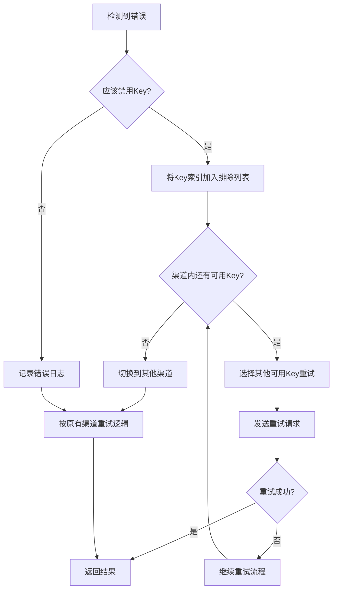

# 多Key渠道自动禁用和重试功能

## 概述

多Key渠道的自动禁用和重试功能提供了智能的错误处理机制，可以自动禁用有问题的API Key，并在重试时智能跳过已失败的Key，确保服务的高可用性。

## 核心特性

### 1. 智能Key选择
- **正常模式**: 按设定的轮询/随机模式选择Key
- **重试模式**: 自动排除已失败的Key索引
- **故障隔离**: 单个Key的故障不影响其他Key的使用

### 2. 自动禁用机制
- **单Key禁用**: 只禁用有问题的特定Key
- **渠道禁用**: 当所有Key都被禁用时，整个渠道自动禁用
- **错误类型识别**: 根据错误类型智能判断是否需要禁用

### 3. 重试策略
- **Key级重试**: 在同一渠道内尝试其他可用Key
- **渠道级重试**: 切换到其他可用渠道（遵循现有重试逻辑）
- **智能排除**: 重试时自动跳过已知的问题Key

## 自动禁用条件

### API Key相关错误
```
- invalid_api_key
- account_deactivated  
- authentication_error
- permission_error
- API key not valid
- HTTP 401 Unauthorized
```

### 余额/配额相关错误
```
- insufficient_quota
- credit balance is too low
- not_enough_credits
- resource pack exhausted
- billing to be enabled
```

### 账户状态错误
```
- organization has been disabled
- Operation not allowed
```

## 工作流程

### 1. 正常请求流程


### 2. 重试机制


## API接口

### 1. 获取渠道健康状态
```http
GET /api/channel/{id}/keys/health
```

**响应示例:**
```json
{
  "success": true,
  "data": {
    "channel_id": 1,
    "channel_name": "GPT-4聚合渠道",
    "is_multi_key": true,
    "selection_mode": 0,
    "total_keys": 5,
    "enabled_keys": 3,
    "disabled_keys": 1,
    "auto_disabled_keys": 1,
    "healthy_ratio": 0.6,
    "overall_health": "good",
    "keys_health": [
      {
        "index": 0,
        "key": "sk-1234***abcd",
        "status": 1,
        "status_text": "已启用",
        "usage": 1500,
        "last_used": 1703515200,
        "health_score": 85
      },
      {
        "index": 1,
        "key": "sk-5678***efgh",
        "status": 3,
        "status_text": "自动禁用",
        "usage": 800,
        "last_used": 1703510000,
        "health_score": 0
      }
    ]
  }
}
```

### 2. 手动重试Key
```http
POST /api/channel/keys/retry
```

**请求体:**
```json
{
  "channel_id": 1,
  "key_index": 1
}
```

**响应示例:**
```json
{
  "success": true,
  "message": "Key enabled and ready for retry"
}
```

## 健康评分系统

### Key健康分数计算
- **基础分数**: 100分
- **状态扣分**: 非启用状态 = 0分
- **使用频率扣分**: 
  - 使用次数 > 10000: -20分
  - 使用次数 > 5000: -10分
- **活跃度扣分**:
  - 7天未使用: -30分
  - 3天未使用: -15分

### 渠道整体健康等级
- **excellent** (优秀): 启用率 ≥ 80%
- **good** (良好): 启用率 ≥ 60%
- **fair** (一般): 启用率 ≥ 40%
- **poor** (较差): 启用率 > 0%
- **critical** (危急): 启用率 = 0%

## 配置选项

### 渠道级配置
```go
type Channel struct {
    AutoDisabled bool `json:"auto_disabled"` // 是否允许自动禁用
    // ... 其他字段
}
```

### 系统级配置
```go
// 在 common/config 中
var AutomaticDisableChannelEnabled bool // 全局自动禁用开关
var RetryTimes int                      // 重试次数
```

## 最佳实践

### 1. 监控建议
- 定期检查渠道健康状态
- 设置Key健康分数阈值告警
- 监控自动禁用频率

### 2. Key管理建议
- 保持每个聚合渠道至少3-5个有效Key
- 定期轮换使用频率过高的Key
- 及时处理自动禁用的Key

### 3. 重试策略优化
- 合理设置重试次数（推荐3-5次）
- 对于已知的持久性错误，及时手动禁用相关Key
- 使用批次标识便于统一管理相关Key

## 故障处理流程

### 1. 单Key故障
```bash
# 检查渠道健康状态
curl -X GET "/api/channel/1/keys/health"

# 手动重试特定Key
curl -X POST "/api/channel/keys/retry" \
  -d '{"channel_id": 1, "key_index": 2}'
```

### 2. 批量Key故障
```bash
# 批量禁用问题Key
curl -X POST "/api/channel/keys/batch-toggle" \
  -d '{"channel_id": 1, "key_indices": [1, 3, 4], "enabled": false}'

# 导入替换Key
curl -X POST "/api/channel/keys/import" \
  -d '{"channel_id": 1, "keys": ["new-key-1", "new-key-2"], "mode": 1}'
```

### 3. 整个渠道故障
当所有Key都被禁用时，渠道会自动禁用。需要：
1. 检查并修复Key问题
2. 重新启用可用的Key
3. 手动启用渠道

## 日志和监控

### 日志级别
- **Info**: 正常的Key切换和重试
- **Warning**: Key被自动禁用
- **Error**: 渠道被完全禁用

### 监控指标
- Key启用率
- 自动禁用频率
- 重试成功率
- 渠道健康分数变化趋势

### 示例日志
```
[INFO] channel:1;requestModel:gpt-4;keyIndex:2;maskedKey:sk-1234***abcd
[WARN] Auto-disabled key 1 (sk-5678***efgh) in multi-key channel 1 due to error: invalid_api_key
[ERROR] Channel 1 auto-disabled: all keys are disabled
```

---

**注意事项:**
1. 自动禁用功能需要渠道设置 `auto_disabled: true`
2. 系统级别需要启用 `AutomaticDisableChannelEnabled`
3. 重试逻辑遵循现有的渠道重试机制
4. 建议定期监控和维护Key的健康状态

**版本**: v1.0  
**更新时间**: 2024-01-15
