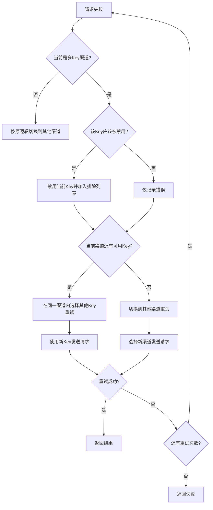

# 多Key渠道重试逻辑详解

## 1. `AutomaticDisableChannelEnabled` 参数说明

### 作用
`AutomaticDisableChannelEnabled` 是一个**全局系统级别的开关**，控制是否启用自动禁用功能。

### 配置位置
```go
// 在 common/config/config.go 中
var AutomaticDisableChannelEnabled = false  // 默认为false（关闭）
```

### 影响范围
```go
// 在 relay/util/common.go 中
func ShouldDisableChannel(err *relaymodel.Error, statusCode int) bool {
    if !config.AutomaticDisableChannelEnabled {
        return false  // 如果全局开关关闭，永远不自动禁用
    }
    
    // 只有当开关为true时，才会根据错误类型判断是否禁用
    if statusCode == http.StatusUnauthorized {
        return true
    }
    // ... 其他错误判断逻辑
}
```

### 设置方法
```bash
# 通过环境变量或管理界面设置
# 需要在系统配置中启用这个选项
```

## 2. 多Key渠道重试逻辑

### 优化后的两层重试机制



### 具体重试流程

#### 阶段1：渠道内Key重试
当多Key渠道中的某个Key失败时：

1. **错误检测**：检查错误是否需要禁用Key
2. **Key禁用**：如果需要，禁用失败的Key并加入排除列表
3. **同渠道重试**：在同一渠道内选择其他可用Key
4. **重试请求**：使用新的Key重试请求

```go
// 优先在同一多Key渠道内重试
if retryInSameChannel && currentChannel != nil && currentChannel.MultiKeyInfo.IsMultiKey {
    excludedKeys := getExcludedKeyIndicesFromContext(c)
    _, _, err := currentChannel.GetNextAvailableKeyWithRetry(excludedKeys)
    if err == nil {
        // 还有可用Key，继续在同一渠道内重试
        logger.Infof(ctx, "Retrying with another key in multi-key channel #%d", currentChannel.Id)
    }
}
```

#### 阶段2：跨渠道重试
当当前多Key渠道没有更多可用Key时：

1. **渠道切换**：按优先级选择其他渠道
2. **清除状态**：清除之前的排除Key列表
3. **正常重试**：按原有逻辑进行渠道级重试

```go
if !retryInSameChannel {
    // 选择新渠道（可能是不同优先级）
    currentChannel, err = dbmodel.CacheGetRandomSatisfiedChannel(group, originalModel, i != retryTimes)
    
    // 清除之前的排除Key列表，因为这是新渠道
    c.Set("excluded_key_indices", []int{})
}
```

## 3. 重试优先级说明

### 优先级顺序
1. **同渠道Key重试** - 优先级最高
2. **跨渠道重试** - 按现有优先级逻辑

### 优先级选择逻辑
```go
// 在 model/cache.go 的 CacheGetRandomSatisfiedChannel 中
if ignoreFirstPriority && len(priorities) > 1 {
    // 重试时，尝试选择次高优先级
    priorityToUse = priorities[1]
} else {
    // 初始请求或只有一个优先级时，选择最高优先级
    priorityToUse = priorities[0]
}
```

## 4. 实际场景示例

### 场景1：多Key渠道部分Key失败
```
初始状态：
- 渠道A (优先级10): Key1, Key2, Key3 (多Key模式)
- 渠道B (优先级5): Key4 (单Key模式)

请求流程：
1. 选择渠道A，使用Key1 → 失败（invalid_api_key）
2. 禁用Key1，在渠道A内选择Key2 → 成功
3. 返回结果

结果：Key1被禁用，但渠道A仍然可用
```

### 场景2：多Key渠道所有Key都失败
```
初始状态：
- 渠道A (优先级10): Key1, Key2 (多Key模式)
- 渠道B (优先级5): Key3 (单Key模式)

请求流程：
1. 选择渠道A，使用Key1 → 失败（invalid_api_key）
2. 禁用Key1，在渠道A内选择Key2 → 失败（insufficient_quota）
3. 禁用Key2，渠道A没有更多可用Key
4. 切换到渠道B，使用Key3 → 成功
5. 返回结果

结果：渠道A被完全禁用，但系统切换到渠道B继续服务
```

### 场景3：AutomaticDisableChannelEnabled=false
```
配置：AutomaticDisableChannelEnabled = false

请求流程：
1. 选择渠道A，使用Key1 → 失败（invalid_api_key）
2. 不禁用Key1（因为全局开关关闭），但记录错误
3. 切换到渠道B → 成功
4. 返回结果

结果：所有Key保持启用状态，但会切换渠道重试
```

## 5. 配置建议

### 系统管理员
```bash
# 推荐启用自动禁用功能
AutomaticDisableChannelEnabled = true

# 设置合理的重试次数（推荐3-5次）
RetryTimes = 3
```

### 渠道配置
```bash
# 每个渠道可以单独控制是否允许自动禁用
auto_disabled = true  # 推荐启用

# 多Key渠道建议配置3-5个Key
keys = ["key1", "key2", "key3", "key4", "key5"]
```

## 6. 监控和日志

### 关键日志示例
```
[INFO] Retrying with another key in multi-key channel #1 (remain times 2)
[WARN] Auto-disabled key 0 (sk-1234***abcd) in multi-key channel 1 due to error: invalid_api_key
[INFO] No more available keys in current multi-key channel #1, switching to other channels
[INFO] Using channel #2 to retry (remain times 1)
```

### 监控指标
- 同渠道Key重试次数
- 跨渠道重试次数
- Key自动禁用频率
- 渠道切换频率

## 7. 总结

**回答你的问题：**

1. **`AutomaticDisableChannelEnabled`** 是全局开关，控制是否启用自动禁用功能
2. **多Key渠道重试逻辑**：
   - **优先在渠道内部重试**：当一个Key失败时，先尝试同一渠道的其他Key
   - **然后跨渠道重试**：只有当前渠道没有更多可用Key时，才按原来的优先级逻辑切换到其他渠道

这样设计的好处：
- **最大化渠道利用率**：充分利用多Key渠道的冗余能力
- **保持原有逻辑**：不破坏现有的优先级和重试机制
- **智能故障隔离**：单个Key的问题不会立即影响整个渠道

---

**配置建议：**
- 启用 `AutomaticDisableChannelEnabled = true`
- 每个多Key渠道配置3-5个Key
- 设置合理的重试次数（3-5次）
- 定期监控Key的健康状态
