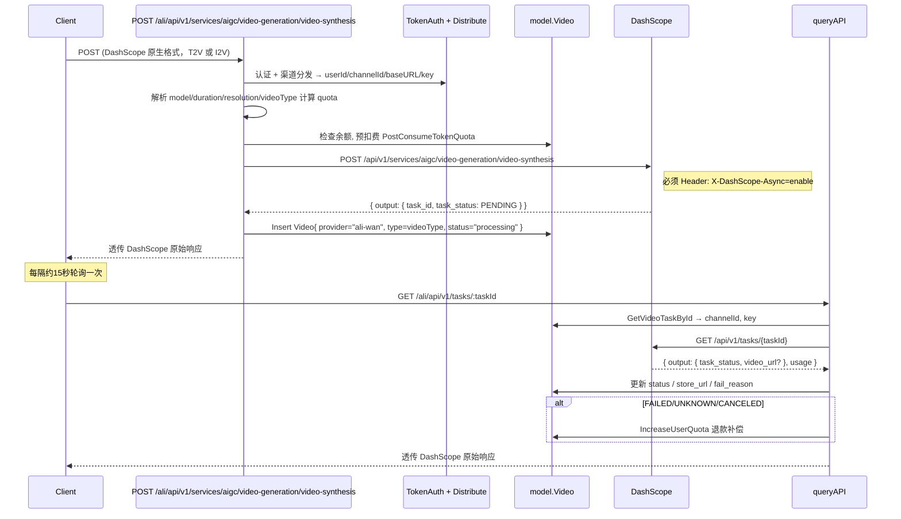

# 阿里云万相视频生成独立接入计划

> **For Claude:** REQUIRED SUB-SKILL: Use superpowers:executing-plans to implement this plan task-by-task.

**Goal:** 在 `/ali` 前缀下映射 DashScope 原生路径，按 Kling 风格实现创建任务、DB 记录、状态流转和轮询查询，T2V 与 I2V 共用同一创建端点。

**Architecture:** 新建独立控制器 `controller/ali_video.go`，复用 `model.Video` DB 结构和现有计费/补偿工具函数，不复用 `relay/controller/video.go` 的任何业务代码。路由路径与 DashScope 原生路径前缀对应，由 `/ali` 路由组统一处理。

**Tech Stack:** Go, Gin, GORM, `relay/channel/ali` model structs, `common.CalculateVideoQuota`

---

## DashScope 视频生成 API 路径（完整映射表）

经官方文档调研确认，**文生视频 (T2V) 和图生视频 (I2V) 使用完全相同的 DashScope 端点**，仅请求体字段不同：

- T2V：`input` 中只有 `prompt`（不含 `img_url`）
- I2V：`input` 中必须含 `img_url`

### 涉及的 DashScope 原生路径（共 2 条）


| #   | 方法     | DashScope 上游路径                                           | 说明                       |
| --- | ------ | -------------------------------------------------------- | ------------------------ |
| 1   | `POST` | `/api/v1/services/aigc/video-generation/video-synthesis` | 创建视频任务（T2V + I2V 共用同一端点） |
| 2   | `GET`  | `/api/v1/tasks/{task_id}`                                | 查询任务状态与结果                |


### one-api 对外暴露路径（/ali 前缀，路径与 DashScope 对应）


| #   | 方法     | one-api 路径                                                   | 映射到 DashScope                                                 | 中间件                                            |
| --- | ------ | ------------------------------------------------------------ | ------------------------------------------------------------- | ---------------------------------------------- |
| 1   | `POST` | `/ali/api/v1/services/aigc/video-generation/video-synthesis` | `POST /api/v1/services/aigc/video-generation/video-synthesis` | RelayPanicRecover + TokenAuth + **Distribute** |
| 2   | `GET`  | `/ali/api/v1/tasks/:taskId`                                  | `GET /api/v1/tasks/{task_id}`                                 | RelayPanicRecover + TokenAuth（渠道从 DB 取）        |


### 支持的模型

**图生视频 (I2V)**（请求体含 `input.img_url`）：


| 模型名                  | 分辨率可选值          | 时长          |
| -------------------- | --------------- | ----------- |
| `wan2.6-i2v-flash`   | 720P、1080P      | 2-15s（默认5s） |
| `wan2.6-i2v`         | 720P、1080P      | 2-15s（默认5s） |
| `wan2.6-i2v-us`      | 720P、1080P      | 5、10、15s    |
| `wan2.5-i2v-preview` | 480P、720P、1080P | 5、10s       |
| `wan2.2-i2v-flash`   | 480P、720P、1080P | 固定5s        |
| `wan2.2-i2v-plus`    | 480P、1080P      | 固定5s        |
| `wanx2.1-i2v-turbo`  | 480P、720P       | 3、4、5s      |
| `wanx2.1-i2v-plus`   | 720P            | 固定5s        |


**文生视频 (T2V)**（请求体不含 `input.img_url`）：


| 模型名                  | 分辨率可选值                             | 时长          |
| -------------------- | ---------------------------------- | ----------- |
| `wan2.6-t2v`         | 720P、1080P（`size` 字段，如 `1280*720`） | 2-15s（默认5s） |
| `wan2.6-t2v-us`      | 720P、1080P                         | 5、10s       |
| `wan2.5-t2v-preview` | 480P、720P、1080P                    | 5、10s       |
| `wan2.2-t2v-plus`    | 480P、1080P                         | 固定5s        |
| `wanx2.1-t2v-turbo`  | 480P、720P                          | 固定5s        |
| `wanx2.1-t2v-plus`   | 720P                               | 固定5s        |


> **注意**：T2V 用 `parameters.size`（如 `"1280*720"`），I2V 用 `parameters.resolution`（如 `"720P"`）。控制器需兼容两种字段。

### 视频类型自动判断

控制器通过检测 `input.img_url` 自动区分 T2V / I2V，无需客户端额外传参：

```go
videoType := "text-to-video"
if input, ok := requestData["input"].(map[string]interface{}); ok {
    if imgURL, ok := input["img_url"].(string); ok && imgURL != "" {
        videoType = "image-to-video"
    }
}
```

---

## 任务状态流转

```
创建后 DB status: "processing"

DashScope 状态          →  DB status       →  操作
PENDING / RUNNING       →  "processing"    →  无
SUCCEEDED               →  "succeed"       →  保存 video_url 到 store_url
FAILED / UNKNOWN        →  "failed"        →  写 fail_reason + 退款补偿
CANCELED                →  "failed"        →  退款补偿
```

---

## 数据流




---

## Task 1: 新建 `controller/ali_video.go`

**Files:**

- Create: `controller/ali_video.go`

```go
package controller

import (
	"bytes"
	"encoding/json"
	"fmt"
	"io"
	"net/http"
	"strconv"
	"strings"
	"time"

	"github.com/gin-gonic/gin"
	"github.com/songquanpeng/one-api/common"
	"github.com/songquanpeng/one-api/common/logger"
	dbmodel "github.com/songquanpeng/one-api/model"
	alimodel "github.com/songquanpeng/one-api/relay/channel/ali"
	"github.com/songquanpeng/one-api/relay/channel/openai"
	"github.com/songquanpeng/one-api/relay/util"
)

const aliWanProvider = "ali-wan"

// mapAliWanStatus 将 DashScope 任务状态映射为 DB status
func mapAliWanStatus(dashStatus string) string {
	switch dashStatus {
	case "SUCCEEDED":
		return "succeed"
	case "FAILED", "UNKNOWN", "CANCELED":
		return "failed"
	default: // PENDING, RUNNING
		return "processing"
	}
}

// aliWanBillingInfo 从请求体中提取计费相关字段
type aliWanBillingInfo struct {
	Model      string
	VideoType  string // "text-to-video" or "image-to-video"
	Duration   string
	Resolution string // 统一转换为档位: 480P / 720P / 1080P
}

func parseAliWanBillingInfo(body []byte, metaModel string) aliWanBillingInfo {
	info := aliWanBillingInfo{
		Model:      metaModel,
		VideoType:  "text-to-video",
		Duration:   "5",
		Resolution: "1080P",
	}

	var req map[string]interface{}
	if err := json.Unmarshal(body, &req); err != nil {
		return info
	}

	if m, ok := req["model"].(string); ok && m != "" {
		info.Model = m
	}

	// 判断 T2V / I2V
	if input, ok := req["input"].(map[string]interface{}); ok {
		if imgURL, ok := input["img_url"].(string); ok && imgURL != "" {
			info.VideoType = "image-to-video"
		}
	}

	params, ok := req["parameters"].(map[string]interface{})
	if !ok {
		return info
	}

	// duration
	switch v := params["duration"].(type) {
	case float64:
		info.Duration = strconv.Itoa(int(v))
	case string:
		if v != "" {
			info.Duration = v
		}
	}

	// I2V 用 resolution 字段（"720P"），T2V 用 size 字段（"1280*720"）
	if res, ok := params["resolution"].(string); ok && res != "" {
		info.Resolution = strings.ToUpper(res)
	} else if size, ok := params["size"].(string); ok && size != "" {
		info.Resolution = inferResolutionFromSize(size)
	}

	return info
}

// inferResolutionFromSize 从 "宽*高" 格式推断分辨率档位
func inferResolutionFromSize(size string) string {
	parts := strings.Split(size, "*")
	if len(parts) != 2 {
		return "1080P"
	}
	w, _ := strconv.Atoi(parts[0])
	h, _ := strconv.Atoi(parts[1])
	pixels := w * h
	switch {
	case pixels <= 520000: // 480P: 832*480=399360, 624*624=389376, 480*832=399360
		return "480P"
	case pixels <= 1050000: // 720P: 1280*720=921600, 960*960=921600, 1088*832=905216
		return "720P"
	default: // 1080P: 1920*1080=2073600, 1440*1440=2073600, etc.
		return "1080P"
	}
}

// ─── 创建任务 ──────────────────────────────────────────────────────────────────

// RelayAliVideoCreate 处理 POST /ali/api/v1/services/aigc/video-generation/video-synthesis
// 支持文生视频 (T2V) 和图生视频 (I2V)，共用同一 DashScope 端点
func RelayAliVideoCreate(c *gin.Context) {
	ctx := c.Request.Context()
	meta := util.GetRelayMeta(c)

	bodyBytes, err := io.ReadAll(c.Request.Body)
	if err != nil {
		c.JSON(http.StatusBadRequest, openai.ErrorWrapper(err, "read_body_failed", http.StatusBadRequest).Error)
		return
	}

	billing := parseAliWanBillingInfo(bodyBytes, meta.ActualModelName)

	quota := common.CalculateVideoQuota(billing.Model, billing.VideoType, "*", billing.Duration, billing.Resolution)

	userQuota, err := dbmodel.CacheGetUserQuota(ctx, meta.UserId)
	if err != nil {
		c.JSON(http.StatusInternalServerError, openai.ErrorWrapper(err, "get_quota_failed", http.StatusInternalServerError).Error)
		return
	}
	if userQuota < quota {
		c.JSON(http.StatusPaymentRequired, openai.ErrorWrapper(
			fmt.Errorf("insufficient quota: need %d, have %d", quota, userQuota),
			"insufficient_quota", http.StatusPaymentRequired).Error)
		return
	}

	channel, err := dbmodel.GetChannelById(meta.ChannelId, true)
	if err != nil {
		c.JSON(http.StatusInternalServerError, openai.ErrorWrapper(err, "get_channel_failed", http.StatusInternalServerError).Error)
		return
	}

	baseURL := "https://dashscope.aliyuncs.com"
	if channel.BaseURL != nil && *channel.BaseURL != "" {
		baseURL = strings.TrimRight(*channel.BaseURL, "/")
	}
	upstreamURL := baseURL + "/api/v1/services/aigc/video-generation/video-synthesis"

	req, err := http.NewRequestWithContext(ctx, http.MethodPost, upstreamURL, bytes.NewReader(bodyBytes))
	if err != nil {
		c.JSON(http.StatusInternalServerError, openai.ErrorWrapper(err, "build_request_failed", http.StatusInternalServerError).Error)
		return
	}
	req.Header.Set("Content-Type", "application/json")
	req.Header.Set("Authorization", "Bearer "+channel.Key)
	req.Header.Set("X-DashScope-Async", "enable")

	resp, err := http.DefaultClient.Do(req)
	if err != nil {
		c.JSON(http.StatusBadGateway, openai.ErrorWrapper(err, "upstream_request_failed", http.StatusBadGateway).Error)
		return
	}
	defer resp.Body.Close()

	respBody, err := io.ReadAll(resp.Body)
	if err != nil {
		c.JSON(http.StatusInternalServerError, openai.ErrorWrapper(err, "read_upstream_response_failed", http.StatusInternalServerError).Error)
		return
	}

	var aliResp alimodel.AliVideoResponse
	if err := json.Unmarshal(respBody, &aliResp); err != nil {
		c.Data(resp.StatusCode, "application/json", respBody)
		return
	}

	// 上游业务错误，直接透传，不扣费不建记录
	if aliResp.Code != "" {
		logger.SysError(fmt.Sprintf("[ali-wan] upstream error: code=%s, msg=%s", aliResp.Code, aliResp.Message))
		c.Data(resp.StatusCode, "application/json", respBody)
		return
	}

	taskID := ""
	if aliResp.Output != nil {
		taskID = aliResp.Output.TaskID
	}

	// 预扣费
	if err := dbmodel.PostConsumeTokenQuota(meta.TokenId, quota); err != nil {
		logger.SysError(fmt.Sprintf("[ali-wan] pre-deduct quota failed: %v", err))
	}
	_ = dbmodel.CacheUpdateUserQuota(ctx, meta.UserId)

	// 写 DB 记录
	video := &dbmodel.Video{
		TaskId:     taskID,
		Provider:   aliWanProvider,
		Model:      billing.Model,
		Type:       billing.VideoType,
		Duration:   billing.Duration,
		Resolution: billing.Resolution,
		Status:     "processing",
		Quota:      quota,
		UserId:     meta.UserId,
		Username:   dbmodel.GetUsernameById(meta.UserId),
		ChannelId:  meta.ChannelId,
		CreatedAt:  time.Now().Unix(),
	}
	if err := video.Insert(); err != nil {
		logger.SysError(fmt.Sprintf("[ali-wan] insert video record failed: task_id=%s, %v", taskID, err))
	}

	logger.SysLog(fmt.Sprintf("[ali-wan] task created: task_id=%s, model=%s, type=%s, user_id=%d, channel_id=%d, quota=%d",
		taskID, billing.Model, billing.VideoType, meta.UserId, meta.ChannelId, quota))

	c.Data(resp.StatusCode, "application/json", respBody)
}

// ─── 查询任务结果 ───────────────────────────────────────────────────────────────

// RelayAliVideoResult 处理 GET /ali/api/v1/tasks/:taskId
// 向 DashScope 查询，透传响应，同时更新 DB 状态
func RelayAliVideoResult(c *gin.Context) {
	ctx := c.Request.Context()
	taskID := c.Param("taskId")

	videoTask, err := dbmodel.GetVideoTaskById(taskID)
	if err != nil {
		c.JSON(http.StatusNotFound, openai.ErrorWrapper(
			fmt.Errorf("task not found: %s", taskID), "task_not_found", http.StatusNotFound).Error)
		return
	}

	// 已终态且有缓存 URL，直接返回 DB 结果，避免访问已过期的视频链接
	if videoTask.Status == "succeed" && videoTask.StoreUrl != "" {
		c.JSON(http.StatusOK, buildAliWanCachedResponse(videoTask))
		return
	}

	channel, err := dbmodel.GetChannelById(videoTask.ChannelId, true)
	if err != nil {
		c.JSON(http.StatusInternalServerError, openai.ErrorWrapper(err, "get_channel_failed", http.StatusInternalServerError).Error)
		return
	}

	baseURL := "https://dashscope.aliyuncs.com"
	if channel.BaseURL != nil && *channel.BaseURL != "" {
		baseURL = strings.TrimRight(*channel.BaseURL, "/")
	}
	upstreamURL := fmt.Sprintf("%s/api/v1/tasks/%s", baseURL, taskID)

	req, err := http.NewRequestWithContext(ctx, http.MethodGet, upstreamURL, nil)
	if err != nil {
		c.JSON(http.StatusInternalServerError, openai.ErrorWrapper(err, "build_request_failed", http.StatusInternalServerError).Error)
		return
	}
	req.Header.Set("Authorization", "Bearer "+channel.Key)

	resp, err := http.DefaultClient.Do(req)
	if err != nil {
		c.JSON(http.StatusBadGateway, openai.ErrorWrapper(err, "upstream_request_failed", http.StatusBadGateway).Error)
		return
	}
	defer resp.Body.Close()

	respBody, err := io.ReadAll(resp.Body)
	if err != nil {
		c.JSON(http.StatusInternalServerError, openai.ErrorWrapper(err, "read_response_failed", http.StatusInternalServerError).Error)
		return
	}

	// 解析并更新 DB 状态
	var queryResp alimodel.AliVideoQueryResponse
	if jsonErr := json.Unmarshal(respBody, &queryResp); jsonErr == nil && queryResp.Output != nil {
		dashStatus := queryResp.Output.TaskStatus
		dbStatus := mapAliWanStatus(dashStatus)

		if dbStatus != videoTask.Status {
			updates := map[string]interface{}{
				"status":     dbStatus,
				"updated_at": time.Now().Unix(),
			}
			if dashStatus == "SUCCEEDED" && queryResp.Output.VideoURL != "" {
				updates["store_url"] = queryResp.Output.VideoURL
			}
			if dbStatus == "failed" {
				updates["fail_reason"] = buildAliWanFailMessage(queryResp)
			}

			if err := dbmodel.DB.Model(&dbmodel.Video{}).
				Where("task_id = ?", taskID).
				Updates(updates).Error; err != nil {
				logger.SysError(fmt.Sprintf("[ali-wan] update task status failed: task_id=%s, %v", taskID, err))
			}

			// 失败时异步退款补偿
			if dbStatus == "failed" && videoTask.Status == "processing" {
				go compensateAliWanTask(taskID, videoTask)
			}
		}
	}

	c.Data(resp.StatusCode, "application/json", respBody)
}

// ─── 辅助函数 ──────────────────────────────────────────────────────────────────

func buildAliWanFailMessage(resp alimodel.AliVideoQueryResponse) string {
	if resp.Output != nil {
		if resp.Output.Code != "" && resp.Output.Message != "" {
			return fmt.Sprintf("[%s] %s", resp.Output.Code, resp.Output.Message)
		}
		if resp.Output.Message != "" {
			return resp.Output.Message
		}
	}
	if resp.Message != "" {
		return resp.Message
	}
	return "task failed"
}

// buildAliWanCachedResponse 从 DB 构造已缓存的成功响应（DashScope 格式）
func buildAliWanCachedResponse(v *dbmodel.Video) map[string]interface{} {
	return map[string]interface{}{
		"request_id": "",
		"output": map[string]interface{}{
			"task_id":     v.TaskId,
			"task_status": "SUCCEEDED",
			"video_url":   v.StoreUrl,
		},
	}
}

// compensateAliWanTask 退款补偿（异步执行）
func compensateAliWanTask(taskID string, v *dbmodel.Video) {
	if v.Quota <= 0 {
		return
	}
	if err := dbmodel.IncreaseUserQuota(v.UserId, v.Quota); err != nil {
		logger.SysError(fmt.Sprintf("[ali-wan] compensate quota failed: task_id=%s, user_id=%d, quota=%d, err=%v",
			taskID, v.UserId, v.Quota, err))
		return
	}
	logger.SysLog(fmt.Sprintf("[ali-wan] compensated: task_id=%s, user_id=%d, quota=%d", taskID, v.UserId, v.Quota))
}
```

---

## Task 2: 修改 `router/relay-router.go`

**Files:**

- Modify: `router/relay-router.go` (在 `SetRelayRouter` 末尾最后一个 `}` 前追加)

```go
// 阿里云万相视频生成路由组
// 路径与 DashScope 原生路径对应，统一支持 T2V 和 I2V
// POST 创建：需要 Distribute 选渠道
// GET  查询：不需要 Distribute，渠道从 DB 取
aliVideoCreateRouter := router.Group("/ali")
aliVideoCreateRouter.Use(middleware.RelayPanicRecover(), middleware.TokenAuth(), middleware.Distribute())
{
    aliVideoCreateRouter.POST("/api/v1/services/aigc/video-generation/video-synthesis", controller.RelayAliVideoCreate)
}

aliVideoResultRouter := router.Group("/ali")
aliVideoResultRouter.Use(middleware.RelayPanicRecover(), middleware.TokenAuth())
{
    aliVideoResultRouter.GET("/api/v1/tasks/:taskId", controller.RelayAliVideoResult)
}
```

---

## Task 3: 验证编译

```bash
cd /Users/yueqingli/code/one-api && go build ./...
```

预期：无编译错误。常见问题：

- `dbmodel.IncreaseUserQuota` 若不存在，改用 `dbmodel.PostConsumeTokenQuota(meta.TokenId, -quota)`
- import 路径确认为 `github.com/songquanpeng/one-api/relay/channel/ali`

---

## 关键依赖

- `dbmodel.Video` — [model/video.go](model/video.go)：`task_id / provider / status / store_url / quota / fail_reason` 字段均已存在
- `alimodel.AliVideoResponse` / `AliVideoQueryResponse` — [relay/channel/ali/model.go](relay/channel/ali/model.go)
- `common.CalculateVideoQuota` — [common/video-pricing.go](common/video-pricing.go)
- `dbmodel.PostConsumeTokenQuota` / `CacheGetUserQuota` / `GetChannelById` — 现有 model 包函数
- `middleware.Distribute()` — 仅创建接口使用；查询接口不使用（渠道信息来自 DB）

