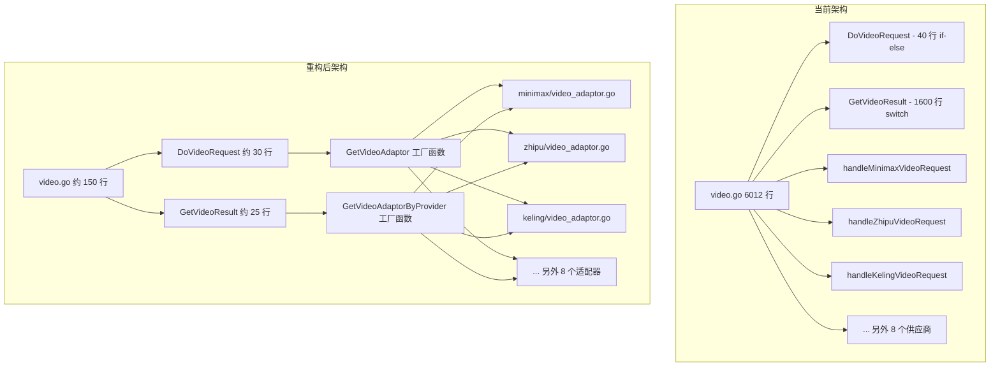

# 视频处理适配器模式重构方案

## 当前问题

`[relay/controller/video.go](relay/controller/video.go)` 是一个 6012 行的巨型文件，包含全部 11 个视频供应商的逻辑：

- **Minimax**、**Zhipu（智谱）**、**Kling（可灵）**、**Runway**、**Luma**、**Pixverse**、**Doubao（豆包）**、**Veo（VertexAI）**、**Ali（阿里/通义万相）**、**Sora（OpenAI）**、**Grok（xAI）**

两个巨型函数占据了文件主体：

- `DoVideoRequest`（第 130 行）：40 行的 if-else 链，按模型名称分派请求
- `GetVideoResult`（第 3671 行）：1600+ 行的 switch-case，处理结果查询

每个供应商都重复同样的模式：请求转换 -> 预扣费检查 -> HTTP 请求 -> 响应解析 -> 视频日志创建 -> 配额扣减。这套流程重复了约 11 次，仅有细微差异。

## 推荐方案：高层级 VideoAdaptor 接口

### 为什么选择高层级接口而非细粒度接口

现有的 `VideoAdaptor` 接口在 `[relay/channel/interface.go](relay/channel/interface.go)` 中定义了细粒度方法（`ConvertVideoRequest`、`GetRequestURL`、`SetupRequestHeader`、`DoRequest`、`DoResponse`），仿照了文本 `Adaptor` 接口的设计。但是，视频供应商之间的差异远大于文本供应商：

- **Sora**：同时支持 `multipart/form-data` 和 JSON 格式，有 remix 模式
- **VertexAI/Veo**：需要通过服务账号 JSON 做 OAuth2 认证，结果查询使用 POST 请求
- **Kling（可灵）**：使用 AK/SK 生成 JWT 令牌，有 5 种以上的端点类型（文生视频、图生视频、口型同步、多图生视频、人脸识别）
- **Doubao（豆包）**：HMAC 签名，基于人民币的配额计算

细粒度接口会迫使控制器处理所有这些差异，违背了抽象的初衷。高层级接口让每个适配器封装自身的全部复杂性，同时保持控制器代码简洁。

### 提议的接口设计

更新 `[relay/channel/interface.go](relay/channel/interface.go)` — 替换当前的 `VideoAdaptor` 接口，移除 `BaseVideoAdaptor`/`MinimaxVideoAdaptor`/`PixverseVideoAdaptor` 结构体：

```go
type VideoAdaptor interface {
    Init(meta *util.RelayMeta)

    // 处理完整的请求流程：转换请求、发送 HTTP、解析响应
    HandleVideoRequest(c *gin.Context, videoRequest *model.VideoRequest,
        meta *util.RelayMeta) (*VideoTaskResult, *model.ErrorWithStatusCode)

    // 处理完整的结果查询流程：构建 URL、认证、发送请求、解析响应、映射状态
    HandleVideoResult(c *gin.Context, videoTask *dbmodel.Video,
        channel *dbmodel.Channel, cfg *dbmodel.ChannelConfig) (
        *model.GeneralFinalVideoResponse, *model.ErrorWithStatusCode)

    GetProviderName() string
    GetSupportedModels() []string
    GetChannelName() string
    GetPrePaymentQuota() int64
}
```

新增任务元数据结构体：

```go
type VideoTaskResult struct {
    TaskId      string
    TaskStatus  string // "succeed"、"failed"、"processing"
    Message     string
    Mode        string
    Duration    string
    VideoType   string
    VideoId     string
    Quota       int64
    Resolution  string
    Credentials string // 用于 VertexAI 保存凭证
}
```

### 精简后的控制器流程

`**DoVideoRequest**`（约 30 行，原来 6000+ 行）：

```go
func DoVideoRequest(c *gin.Context, modelName string) *model.ErrorWithStatusCode {
    var videoRequest model.VideoRequest
    common.UnmarshalBodyReusable(c, &videoRequest)
    meta := util.GetRelayMeta(c)

    adaptor := helper.GetVideoAdaptor(modelName)
    if adaptor == nil { return unsupportedModelError }
    adaptor.Init(meta)

    // 预扣费余额检查
    prePayment := adaptor.GetPrePaymentQuota()
    userQuota, _ := dbmodel.CacheGetUserQuota(ctx, meta.UserId)
    if userQuota-prePayment < 0 { return insufficientBalanceError }

    // 供应商特定处理
    taskResult, err := adaptor.HandleVideoRequest(c, &videoRequest, meta)
    if err != nil { return err }

    // 通用逻辑：日志 + 响应 + 配额
    CreateVideoLog(adaptor.GetProviderName(), taskResult.TaskId, meta, ...)
    c.JSON(200, model.GeneralVideoResponse{
        TaskId: taskResult.TaskId, TaskStatus: taskResult.TaskStatus, ...
    })
    return handleSuccessfulResponseWithQuota(c, ctx, meta, ...)
}
```

`**GetVideoResult**`（约 25 行，原来 1600+ 行）：

```go
func GetVideoResult(c *gin.Context, taskId string) *model.ErrorWithStatusCode {
    videoTask, _ := dbmodel.GetVideoTaskById(taskId)
    channel, _ := dbmodel.GetChannelById(videoTask.ChannelId, true)
    cfg, _ := channel.LoadConfig()

    adaptor := helper.GetVideoAdaptorByProvider(videoTask.Provider)
    adaptor.Init(...)

    result, err := adaptor.HandleVideoResult(c, videoTask, channel, &cfg)
    if err != nil { return err }

    // 通用逻辑：状态更新 + 退款 + 存储视频 URL
    needRefund := UpdateVideoTaskStatus(taskId, result.TaskStatus, result.Message)
    if needRefund { CompensateVideoTask(taskId) }
    if result.VideoResult != "" { dbmodel.UpdateVideoStoreUrl(taskId, result.VideoResult) }

    c.JSON(200, result)
    return nil
}
```

### 各供应商适配器实现

每个供应商创建一个 `video_adaptor.go` 文件。所有供应商的包目录已存在：

- **Minimax** -> `relay/channel/minimax/video_adaptor.go`（替换现有桩代码）
- **Zhipu（智谱）** -> `relay/channel/zhipu/video_adaptor.go`
- **Kling（可灵）** -> `relay/channel/keling/video_adaptor.go`
- **Runway** -> `relay/channel/runway/video_adaptor.go`
- **Luma** -> `relay/channel/luma/video_adaptor.go`
- **Pixverse** -> `relay/channel/pixverse/video_adaptor.go`
- **Doubao（豆包）** -> `relay/channel/doubao/video_adaptor.go`
- **VertexAI/Veo** -> `relay/channel/vertexai/video_adaptor.go`
- **Ali（阿里）** -> `relay/channel/ali/video_adaptor.go`
- **Sora** -> `relay/channel/openai/video_adaptor.go`
- **Grok** -> `relay/channel/xai/video_adaptor.go`

示例实现（Minimax — 简单供应商）：

```go
package minimax

type VideoAdaptor struct {
    Meta *util.RelayMeta
}

func (a *VideoAdaptor) Init(meta *util.RelayMeta) { a.Meta = meta }
func (a *VideoAdaptor) GetProviderName() string    { return "minimax" }
func (a *VideoAdaptor) GetPrePaymentQuota() int64  { return int64(0.2 * config.QuotaPerUnit) }
func (a *VideoAdaptor) GetSupportedModels() []string {
    return []string{"video-01", "S2V-01", "T2V-01", "I2V-01"}
}

func (a *VideoAdaptor) HandleVideoRequest(c *gin.Context, req *model.VideoRequest,
    meta *util.RelayMeta) (*channel.VideoTaskResult, *model.ErrorWithStatusCode) {
    // 将现有的 handleMinimaxVideoRequest + sendRequestMinimaxAndHandleResponse
    // + handleMinimaxVideoResponse 逻辑迁移到这里
    // 返回 VideoTaskResult 而非直接写入 gin context
}

func (a *VideoAdaptor) HandleVideoResult(c *gin.Context, videoTask *dbmodel.Video,
    ch *dbmodel.Channel, cfg *dbmodel.ChannelConfig) (
    *model.GeneralFinalVideoResponse, *model.ErrorWithStatusCode) {
    // 将现有 GetVideoResult 中的 minimax 结果处理逻辑迁移到这里
}
```

### 通用 HTTP 辅助函数

新建 `[relay/channel/video_helper.go](relay/channel/video_helper.go)`，提供可复用的辅助方法：

```go
package channel

// SendJSONVideoRequest 发送 JSON POST 请求并返回原始响应
func SendJSONVideoRequest(url string, body any, headers map[string]string) (*http.Response, []byte, error)

// SendVideoResultQuery 发送 GET 请求用于结果轮询
func SendVideoResultQuery(url string, headers map[string]string) (*http.Response, []byte, error)

// BearerAuthHeaders 返回通用的 Bearer Token 请求头
func BearerAuthHeaders(apiKey string) map[string]string
```

### 工厂函数

添加到 `[relay/helper/main.go](relay/helper/main.go)`：

```go
// GetVideoAdaptor 根据模型名称返回对应的视频适配器
func GetVideoAdaptor(modelName string) channel.VideoAdaptor {
    switch {
    case hasPrefix(modelName, "video-01", "S2V-01", ...):
        return &minimax.VideoAdaptor{}
    case modelName == "cogvideox":
        return &zhipu.VideoAdaptor{}
    // ... 全部 11 个供应商
    }
    return nil
}

// GetVideoAdaptorByProvider 根据供应商名称返回对应的视频适配器（用于结果查询）
func GetVideoAdaptorByProvider(provider string) channel.VideoAdaptor {
    switch provider {
    case "minimax": return &minimax.VideoAdaptor{}
    case "zhipu":   return &zhipu.VideoAdaptor{}
    // ... 全部 11 个供应商
    }
    return nil
}
```

### 保留在控制器中的公用函数

以下函数保留在精简后的 `video.go` 中（或新建 `video_util.go`）：

- `UploadVideoBase64ToR2` — R2 视频上传工具
- `calculateQuota` — 通用配额计算
- `CreateVideoLog` — 视频日志创建
- `handleSuccessfulResponseWithQuota` — 配额扣减
- `UpdateVideoTaskStatus` / `CompensateVideoTask` — 状态更新和退款
- `EncodeJWTToken` — JWT 辅助函数（或迁移到 `keling/` 包）

### 架构迁移数据流




### 分阶段实施

建议分 3 个阶段实施以降低风险：

- **第一阶段**：接口定义 + 3 个简单供应商（Minimax、Zhipu、Runway）+ 控制器重构
- **第二阶段**：中等复杂度供应商（Kling、Luma、Ali、Pixverse、Doubao、Grok）
- **第三阶段**：复杂供应商（Sora、VertexAI/Veo）

每个阶段可以独立测试验证后再进入下一阶段。

### 变更文件清单

- `relay/channel/interface.go` — 更新 VideoAdaptor 接口，新增 VideoTaskResult
- `relay/channel/video_helper.go` — 新建，通用 HTTP 辅助函数
- `relay/channel/*/video_adaptor.go` — 新建，每个供应商一个文件（共 11 个文件）
- `relay/helper/main.go` — 添加 GetVideoAdaptor + GetVideoAdaptorByProvider
- `relay/controller/video.go` — 精简至约 150 行（仅保留通用逻辑）
- `relay/channel/minimax/videoAdaptor.go` — 替换现有桩代码

