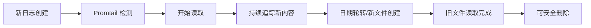

# 日志清理策略指南

生产环境日志清理的完整指南，确保不影响 Promtail 的日志采集。

---

## 📋 目录

- [Promtail 工作原理](#promtail-工作原理)
- [清理策略](#清理策略)
- [实施方案](#实施方案)
- [注意事项](#注意事项)
- [故障排查](#故障排查)

---

## 🔍 Promtail 工作原理

### Positions 文件

Promtail 使用 **positions 文件** 跟踪每个日志文件的读取状态：

```yaml
# ./data/promtail/positions.yaml 示例
positions:
  /var/log/oneapi/oneapi-20260126.log:
    inode: 12345678
    pos: 2048576  # 已读取到 2MB 位置
  /var/log/oneapi/oneapi-20260125.log:
    inode: 12345677
    pos: 5242880  # 已读取完整个文件
```

**关键字段**：
- `inode`：文件的唯一标识符
- `pos`：已读取的字节偏移量

### 日志文件生命周期



---

## ✅ 清理策略

### 策略 1：基于时间的自动清理（推荐）

**原理**：只删除超过保留期的旧文件

**优点**：
- ✅ 简单可靠
- ✅ 不需要检查 Promtail 状态
- ✅ 适合大多数场景

**缺点**：
- ⚠️ 如果 Promtail 出现故障，可能丢失未读取的日志

**保留期建议**：
- 开发环境：3-7 天
- 生产环境：7-30 天（根据合规要求）
- 高负载系统：结合磁盘空间和日志增长速度调整

**实施脚本**：`scripts/simple-cleanup-logs.sh`

---

### 策略 2：检查 Promtail 状态后清理（最安全）

**原理**：确认 Promtail 已完全读取后再删除

**优点**：
- ✅ 零数据丢失风险
- ✅ 适合关键日志系统

**缺点**：
- ⚠️ 脚本较复杂
- ⚠️ 依赖 positions 文件准确性

**实施脚本**：`scripts/safe-cleanup-logs.sh`

---

### 策略 3：Docker 日志轮转（补充方案）

使用 Docker 自带的日志轮转功能（仅适用于容器标准输出）：

```yaml
# docker-compose-deps.yml
services:
  oneapi:
    logging:
      driver: "json-file"
      options:
        max-size: "100m"      # 单个日志文件最大 100MB
        max-file: "10"        # 保留最近 10 个文件
```

**注意**：这只管理容器的 stdout/stderr 日志，不影响应用写入的文件日志。

---

## 🚀 实施方案

### 方案 A：定时清理（cron）

#### 1. 设置脚本权限

```bash
cd /Users/yueqingli/code/one-api
chmod +x scripts/simple-cleanup-logs.sh
```

#### 2. 添加 cron 任务

```bash
# 编辑 crontab
crontab -e

# 添加以下行（每天凌晨 2 点执行）
0 2 * * * /Users/yueqingli/code/one-api/scripts/simple-cleanup-logs.sh >> /var/log/oneapi-cleanup.log 2>&1
```

#### 3. 验证 cron 任务

```bash
# 查看已添加的任务
crontab -l

# 手动测试脚本
./scripts/simple-cleanup-logs.sh
```

---

### 方案 B：使用 logrotate（Linux 推荐）

#### 1. 创建 logrotate 配置

```bash
sudo vim /etc/logrotate.d/oneapi
```

#### 2. 配置内容

```bash
/Users/yueqingli/code/one-api/logs/oneapi-*.log {
    daily                    # 每天轮转
    missingok                # 文件不存在不报错
    rotate 7                 # 保留 7 个归档
    compress                 # 压缩旧日志
    delaycompress            # 延迟一天压缩（给 Promtail 时间读取）
    notifempty              # 空文件不轮转
    dateext                  # 使用日期作为后缀
    dateformat -%Y%m%d
    nocreate                 # 不创建新文件（应用自己创建）
    sharedscripts
    postrotate
        # 重启 Promtail 以重新扫描日志文件（可选）
        # docker restart one-api-promtail
    endscript
}
```

#### 3. 测试配置

```bash
# 测试运行（不实际执行）
sudo logrotate -d /etc/logrotate.d/oneapi

# 强制执行一次
sudo logrotate -f /etc/logrotate.d/oneapi
```

---

### 方案 C：集成到应用（代码级）

在应用中实现自动清理（使用 Go 的 `time.Ticker`）：

```go
// 在 main.go 中启动清理协程
go func() {
    ticker := time.NewTicker(24 * time.Hour)
    defer ticker.Stop()
    
    for range ticker.C {
        cleanupOldLogs(7) // 清理 7 天前的日志
    }
}()

func cleanupOldLogs(retentionDays int) {
    cutoff := time.Now().AddDate(0, 0, -retentionDays)
    
    files, _ := filepath.Glob(filepath.Join(logger.LogDir, "oneapi-*.log"))
    for _, file := range files {
        info, err := os.Stat(file)
        if err != nil {
            continue
        }
        
        if info.ModTime().Before(cutoff) {
            os.Remove(file)
            log.Printf("Cleaned up old log: %s", file)
        }
    }
}
```

---

## ⚠️ 注意事项

### 1. 不要删除当前日志文件

**错误示例**：
```bash
# ❌ 危险！可能删除当前日志
rm /var/log/oneapi/oneapi-$(date +%Y%m%d).log
```

**正确做法**：
- 只删除旧日期的文件
- 使用 `find -mtime +N` 确保时间间隔

### 2. 避免在高峰期清理

```bash
# ✅ 选择低峰时段（如凌晨 2-4 点）
0 2 * * * /path/to/cleanup.sh
```

### 3. 确保 Promtail 容器持久化

```yaml
# docker-compose-deps.yml
volumes:
  - ./data/promtail:/tmp  # positions 文件持久化
```

如果 positions 文件丢失，Promtail 会重新读取所有日志文件。

### 4. 监控磁盘空间

```bash
# 添加磁盘空间告警
if [ $(df -h /var/log | tail -1 | awk '{print $5}' | sed 's/%//') -gt 80 ]; then
    echo "ALERT: Disk usage > 80%" | mail -s "Disk Alert" admin@example.com
fi
```

### 5. 留出缓冲时间

保留期应该 > Promtail 故障恢复时间：
- 如果 Promtail 可能停机 24 小时 → 保留至少 3 天
- 如果 Promtail 可能停机 1 周 → 保留至少 14 天

---

## 🐛 故障排查

### 问题 1：删除后 Promtail 重新读取旧数据

**症状**：删除文件后，新创建同名文件被 Promtail 重新读取

**原因**：Promtail 通过 inode 跟踪文件，删除后 inode 改变

**解决**：
1. 应用使用日期命名日志文件（已实现）
2. 每天自动创建新文件（已实现）
3. 不要删除后立即创建同名文件

### 问题 2：Positions 文件越来越大

**症状**：`positions.yaml` 包含大量已删除文件的记录

**原因**：Promtail 不会自动清理已删除文件的记录

**解决**：
```bash
# 定期重启 Promtail（会自动清理无效记录）
docker restart one-api-promtail

# 或手动编辑 positions.yaml 删除旧记录
```

### 问题 3：清理后 Grafana 查询不到旧数据

**症状**：删除日志文件后，Grafana 无法查询历史数据

**说明**：这是正常的！
- Loki 只存储一定时间的数据（默认配置）
- 删除日志文件不影响 Loki 中已存储的数据
- 如需长期保留，配置 Loki 的 retention 策略

### 问题 4：清理脚本权限不足

**错误**：`Permission denied` 删除日志文件

**解决**：
```bash
# 方案 1：修改脚本权限
chmod +x cleanup.sh
sudo ./cleanup.sh

# 方案 2：修改日志目录权限
sudo chown -R $USER:$USER /path/to/logs
```

---

## 📊 清理策略对比

| 策略 | 安全性 | 复杂度 | 适用场景 |
|------|--------|--------|----------|
| 基于时间 | ⭐⭐⭐⭐ | ⭐ | 大多数生产环境 |
| 检查 Promtail | ⭐⭐⭐⭐⭐ | ⭐⭐⭐ | 关键日志系统 |
| Logrotate | ⭐⭐⭐⭐ | ⭐⭐ | Linux 服务器 |
| 应用内清理 | ⭐⭐⭐⭐ | ⭐⭐⭐ | 需要细粒度控制 |

---

## 🎯 推荐配置（生产环境）

### 日志保留策略

```yaml
# 推荐的分层保留策略

应用日志文件:
  - 保留期: 7-14 天
  - 清理时间: 每天凌晨 2 点
  - 方法: cron + simple-cleanup-logs.sh

Loki 存储:
  - 保留期: 30-90 天
  - 压缩: 自动
  - 配置: loki-config.yaml

长期归档（可选）:
  - 保留期: 1-7 年
  - 存储: S3/OSS 对象存储
  - 压缩: gzip
```

### 完整自动化方案

```bash
# 1. 每天凌晨 2 点清理应用日志
0 2 * * * /path/to/simple-cleanup-logs.sh

# 2. 每周日凌晨 3 点归档到对象存储（可选）
0 3 * * 0 /path/to/archive-to-s3.sh

# 3. 每月 1 号检查磁盘空间
0 4 1 * * /path/to/check-disk-space.sh
```

---

## 📚 相关文档

- [Promtail 配置参考](./promtail-config.yaml)
- [Loki 保留策略配置](./loki-config.yaml)
- [日志系统故障排查](./TROUBLESHOOTING.md)

---

**创建时间**: 2026-01-26  
**维护者**: DevOps Team  
**版本**: 1.0
